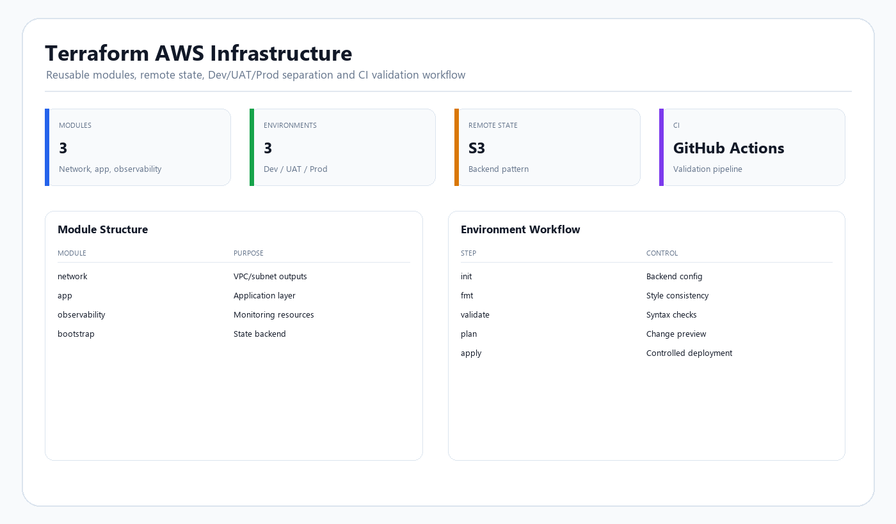

# Terraform AWS Infrastructure


## Demo Preview



## Goals

- Demonstrate reusable Terraform module design.
- Separate Dev / UAT / Prod environments.
- Bootstrap encrypted remote state.
- Use explicit provider/version constraints.
- Validate code automatically in CI.
- Document a safe deployment workflow.
- Avoid hard-coded secrets and credentials.
- Show how Terraform can support repeatable cloud engineering.

## Repository Structure

```text
terraform-aws-infrastructure/
├── bootstrap/                 # Creates S3 state bucket + DynamoDB locking table
├── envs/
│   ├── dev/
│   ├── uat/
│   └── prod/
├── modules/
│   ├── network/
│   ├── app/
│   └── observability/
├── .github/workflows/
│   └── terraform-ci.yml
├── scripts/
│   ├── validate.sh
│   └── plan.sh
├── docs/
│   ├── architecture.md
│   ├── state_and_security.md
│   ├── deployment_workflow.md
│   └── interview_case_study.md
├── .gitignore
└── README.md
```

## Environment Model

```text
Dev  ---> rapid iteration / lower capacity
UAT  ---> pre-production validation
Prod ---> protected production-style configuration
```

Each environment reuses the same modules while supplying different variables.

## Modules

### `network`
Creates:
- VPC
- Two public subnets
- Two private subnets
- Internet Gateway
- NAT Gateway
- Public/private route tables
- VPC Flow Logs

### `app`
Creates:
- Security groups
- IAM instance role
- Launch template
- Application Load Balancer
- Auto Scaling Group

### `observability`
Creates:
- SNS topic
- CloudWatch alarms

## Remote State

The `bootstrap/` directory creates:

- Versioned S3 bucket
- Server-side encryption
- Public access blocking
- DynamoDB table for state locking

Environment backends use separate state keys, e.g.:

```text
dev/terraform.tfstate
uat/terraform.tfstate
prod/terraform.tfstate
```

## CI Workflow

GitHub Actions performs:

- `terraform fmt -check`
- `terraform init -backend=false`
- `terraform validate`

A production pipeline should also add:
- static analysis (`tfsec`, Checkov, Trivy)
- policy checks
- unit/integration tests
- protected approval gates
- OIDC-based cloud authentication
- plan artifact review

## Deployment Workflow

```text
Code change
   ↓
Pull Request
   ↓
Format / Validate / Security Checks
   ↓
Terraform Plan
   ↓
Peer Review
   ↓
Environment Approval
   ↓
Terraform Apply
   ↓
Post-deployment Validation
```

## Security Principles

- No secrets in source control.
- Prefer IAM roles / OIDC over long-lived AWS access keys.
- Encrypt Terraform state.
- Block public access to state storage.
- Separate state by environment.
- Restrict IAM permissions.
- Require code review before production changes.
- Log infrastructure changes.
- Use explicit provider versions.
- Treat state as sensitive data.

## Running Locally

### 1. Bootstrap remote state

```bash
cd bootstrap
terraform init
terraform plan
terraform apply
```

### 2. Configure backend values

Update the backend settings in each environment to reference your bucket and region.

### 3. Validate an environment

```bash
cd envs/dev
terraform init
terraform fmt -check -recursive
terraform validate
terraform plan
```

## Cost Warning

This lab may create chargeable AWS resources including NAT Gateway and Application Load Balancer. Review the plan carefully and destroy resources when not required.

## Skills Demonstrated

- Terraform
- AWS
- Infrastructure as Code
- Remote state
- S3
- DynamoDB
- VPC networking
- IAM
- Load balancing
- Auto Scaling
- CloudWatch
- CI/CD
- GitHub Actions
- Environment separation
- Change control
- Cloud security

## Interview Talking Points

1. Why Terraform state is sensitive.
2. Why remote state is better for teams.
3. Why state locking matters.
4. Why environments should have separate state.
5. Module design and reuse.
6. Variables vs locals vs outputs.
7. How to avoid secrets in Terraform.
8. How GitHub Actions fits into IaC validation.
9. How you would safely promote changes from Dev to Prod.
10. How to secure Terraform authentication with OIDC.
11. What drift is and how to manage it.
12. How to handle failed applies and recovery.

## Portfolio Classification

**Type:** Portfolio Build  
**Purpose:** Demonstrate production-minded Terraform and AWS infrastructure engineering practices.
